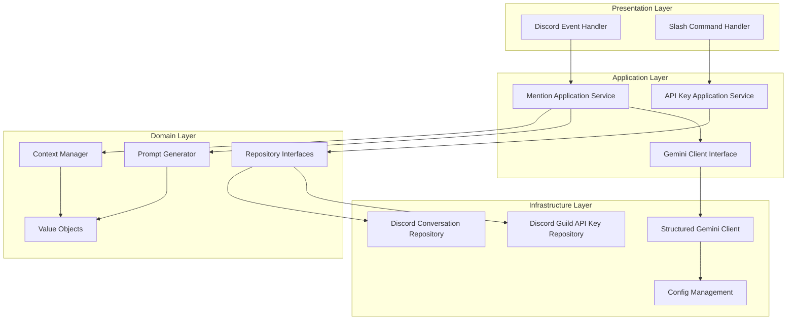
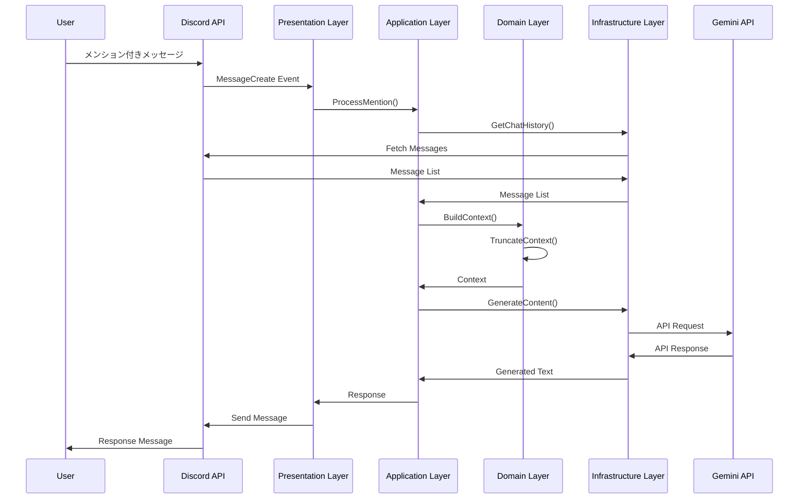
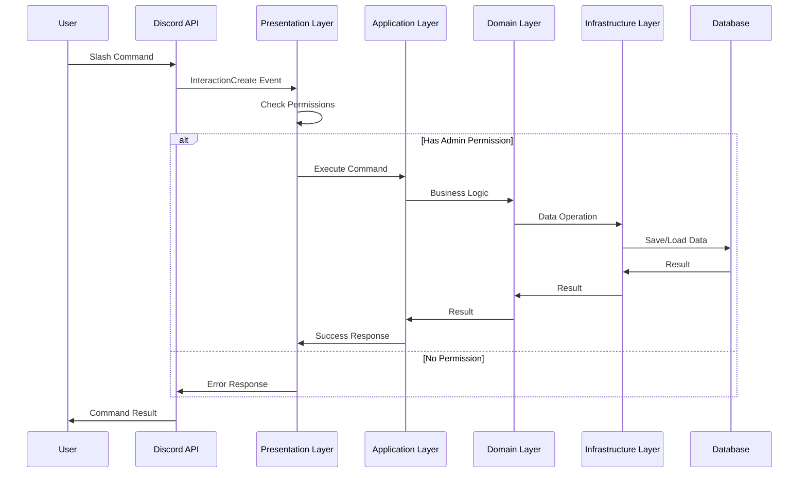

# GeminiBot アーキテクチャドキュメント

## 概要

GeminiBotのアーキテクチャ設計について説明します。本プロジェクトは**ドメイン駆動設計 (DDD)** のアプローチを採用し、クリーンアーキテクチャの原則に基づいて設計されています。

## アーキテクチャ概要

### 設計原則

1. **関心の分離**: 各層が明確な責任を持つ
2. **依存関係の逆転**: 上位層が下位層に依存しない
3. **テスタビリティ**: 各層が独立してテスト可能
4. **拡張性**: 新機能の追加が容易
5. **保守性**: コードの変更影響範囲を最小化

### レイヤー構成



## レイヤー詳細

### 1. Presentation Layer (プレゼンテーション層)

**責任**: 外部インターフェースとの通信

**主要コンポーネント**:
- `discord/slash_command_handler.go`: スラッシュコマンドの処理
- Discordイベントハンドラー（main.go内で実装）

**特徴**:
- Discord APIとの直接的な通信
- イベントの受信と応答の送信
- ユーザー入力の検証と変換
- 権限チェックとエラーハンドリング

### 2. Application Layer (アプリケーション層)

**責任**: ユースケースの実装

**主要コンポーネント**:
- `mention_service.go`: メンション処理のユースケース
- `api_key_service.go`: APIキー管理のユースケース
- `gemini_client.go`: Gemini APIクライアントインターフェース

**特徴**:
- ビジネスロジックの調整
- トランザクション管理
- ドメインサービスの呼び出し
- ファクトリーパターンによるクライアント生成
- サーバー別のAPIキー管理

### 3. Domain Layer (ドメイン層)

**責任**: ビジネスロジックとドメインルール

**主要コンポーネント**:
- `context_manager.go`: コンテキスト管理
- `service.go`: プロンプト生成サービス
- `repository.go`: リポジトリインターフェース
- `value_objects.go`: 値オブジェクト
- `api_key.go`: APIキー関連のドメインロジック

**特徴**:
- ビジネスルールの実装
- ドメインエンティティの定義
- 外部依存の抽象化
- コンテキスト長制限の管理
- プロンプト生成のロジック

### 4. Infrastructure Layer (インフラストラクチャ層)

**責任**: 外部システムとの通信

**主要コンポーネント**:
- `discord/`: Discord APIクライアント
  - `repository.go`: 会話履歴取得
  - `api_key_repository.go`: APIキー管理
- `gemini/`: Gemini APIクライアント
  - `structured_client.go`: 構造化コンテキスト対応クライアント
  - `client.go`: 基本クライアント
- `config/`: 設定管理
  - `config.go`: 設定構造体定義

**特徴**:
- 外部APIとの通信
- データの永続化
- 設定の管理
- 構造化コンテキストの実装
- 安全フィルターの設定

## データフロー

### 1. メンション処理フロー



### 2. スラッシュコマンド処理フロー



## 依存関係管理

### 1. 依存関係の方向

```
Presentation → Application → Domain ← Infrastructure
```

- **Presentation Layer**: Application Layerに依存
- **Application Layer**: Domain Layerに依存
- **Infrastructure Layer**: Domain Layerに依存（依存関係の逆転）
- **Config Layer**: 全層から参照可能

### 2. インターフェース分離

各層はインターフェースを通じて通信し、実装の詳細に依存しません。

```go
// Application Layer
type GeminiClient interface {
    GenerateTextWithStructuredContext(ctx context.Context, systemPrompt string, conversationHistory []domain.Message, userQuestion string) (string, error)
}

// Infrastructure Layer
type StructuredGeminiClient struct {
    client *genai.Client
    config *config.GeminiConfig
}

func (g *StructuredGeminiClient) GenerateTextWithStructuredContext(ctx context.Context, systemPrompt string, conversationHistory []domain.Message, userQuestion string) (string, error) {
    // 実装
}
```

## エラーハンドリング

### 1. エラーの分類

| エラー種別 | 発生層 | 処理方法 |
|-----------|--------|----------|
| ドメインエラー | Domain | ビジネスルール違反、コンテキスト制限超過 |
| アプリケーションエラー | Application | ユースケース実行失敗、APIキー検証失敗 |
| インフラストラクチャエラー | Infrastructure | 外部システム接続失敗、API呼び出し失敗 |
| プレゼンテーションエラー | Presentation | 入力検証失敗、権限不足 |

### 2. エラー伝播

```go
// Domain Layer
func (cm *ContextManager) TruncateConversationHistory(history []Message) []Message {
    if len(history) == 0 {
        return history
    }
    // コンテキスト長制限の適用
    // ...
}

// Application Layer
func (s *MentionApplicationService) HandleMention(ctx context.Context, mention domain.BotMention) (string, error) {
    history, err := s.getConversationHistory(ctx, mention)
    if err != nil {
        return "", fmt.Errorf("チャット履歴の取得に失敗: %w", err)
    }
    // ...
}
```

## 設定管理

### 1. 設定の階層

1. **環境変数**: 本番環境の設定
2. **設定ファイル**: 開発環境の設定
3. **デフォルト値**: アプリケーション内のデフォルト
4. **サーバー別設定**: ギルド固有のAPIキーとモデル設定

### 2. 設定の読み込み順序

```go
func LoadConfig() (*Config, error) {
    // .envファイルを読み込み（ファイルが存在しない場合は無視）
    if err := godotenv.Load(); err != nil {
        fmt.Printf("警告: .envファイルの読み込みに失敗しました: %v\n", err)
    }

    config := &Config{
        Discord: config.DiscordConfig{
            BotToken: getEnvOrDefault("DISCORD_BOT_TOKEN", ""),
        },
        Gemini: config.GeminiConfig{
            APIKey:      getEnvOrDefault("GEMINI_API_KEY", ""),
            ModelName:   getEnvOrDefault("GEMINI_MODEL_NAME", "gemini-2.5-pro"),
            MaxTokens:   int32(getEnvAsIntOrDefault("GEMINI_MAX_TOKENS", 1000)),
            Temperature: float32(getEnvAsFloatOrDefault("GEMINI_TEMPERATURE", 0.7)),
            TopP:        float32(getEnvAsFloatOrDefault("GEMINI_TOP_P", 0.9)),
            TopK:        int32(getEnvAsIntOrDefault("GEMINI_TOP_K", 40)),
        },
        Bot: config.BotConfig{
            MaxContextLength: getEnvAsIntOrDefault("MAX_CONTEXT_LENGTH", 8000),
            MaxHistoryLength: getEnvAsIntOrDefault("MAX_HISTORY_LENGTH", 4000),
            RequestTimeout:   getEnvAsDurationOrDefault("REQUEST_TIMEOUT", 30*time.Second),
            SystemPrompt:     getEnvOrDefault("SYSTEM_PROMPT", "デフォルトのシステムプロンプト"),
        },
    }
    
    // 必須設定の検証
    if err := config.Validate(); err != nil {
        return nil, err
    }
    
    return config, nil
}
```

## テスト戦略

### 1. テストの種類

| テスト種別 | 対象層 | 目的 |
|-----------|--------|------|
| 単体テスト | 全層 | 個別機能の検証 |
| 統合テスト | Application + Domain | ユースケースの検証 |
| エンドツーエンドテスト | 全層 | 全体フローの検証 |

### 2. テストの構造

```go
// 単体テスト例
func TestContextManager_BuildContext(t *testing.T) {
    // Arrange
    manager := NewContextManager()
    messages := []*discordgo.Message{
        {Content: "Hello", Author: &discordgo.User{Username: "user1"}},
        {Content: "Hi there", Author: &discordgo.User{Username: "user2"}},
    }
    
    // Act
    content, err := manager.BuildContext(messages, "What's up?")
    
    // Assert
    assert.NoError(t, err)
    assert.NotNil(t, content)
    assert.Contains(t, content.Parts[0].Text, "Hello")
}
```

## パフォーマンス考慮事項

### 1. 非同期処理

- Discordイベントの非同期処理
- Gemini API呼び出しのタイムアウト設定
- 並行処理によるスループット向上

### 2. キャッシュ戦略

- APIキー情報のキャッシュ
- コンテキストの一時保存
- レスポンスのキャッシュ

### 3. リソース管理

- メモリ使用量の監視
- ゴルーチンの適切な管理
- 接続プールの活用

## セキュリティ考慮事項

### 1. 認証・認可

- Discord Bot Tokenの安全な管理
- 管理者権限の適切な検証
- APIキーの暗号化保存

### 2. 入力検証

- ユーザー入力のサニタイゼーション
- APIキー形式の検証
- コンテキスト長の制限

### 3. ログセキュリティ

- 機密情報のログ除外
- ログファイルのアクセス制御
- 監査ログの記録

## 拡張性

### 1. 新機能の追加

- 新しいスラッシュコマンドの追加
- 複数AIモデルの対応
- カスタムプロンプト機能

### 2. プラグイン機能

- 外部API連携
- データベース連携
- カスタムコマンド

### 3. スケーラビリティ

- 水平スケーリング対応
- ロードバランシング
- 分散処理

## 運用・保守

### 1. 監視

- ヘルスチェック機能
- メトリクス収集
- アラート機能

### 2. デプロイ

- Dockerコンテナ化
- CI/CDパイプライン
- ブルーグリーンデプロイ

### 3. バックアップ・復旧

- 設定データのバックアップ
- ログファイルのローテーション
- 災害復旧計画
