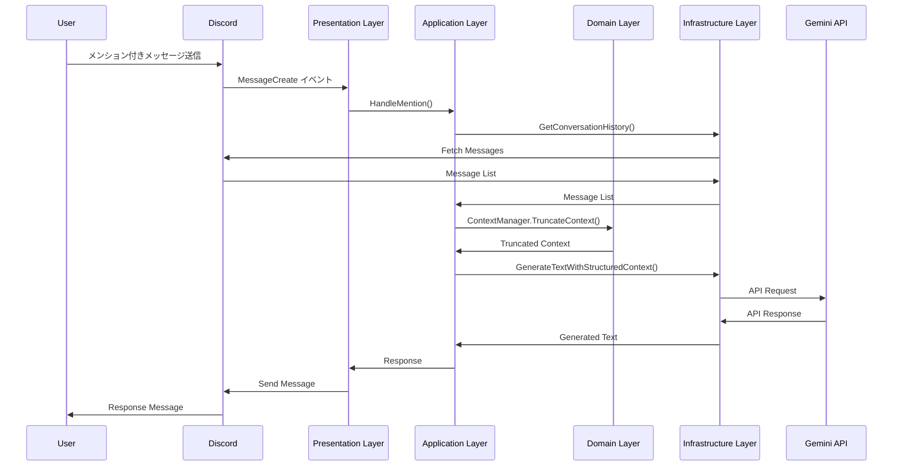
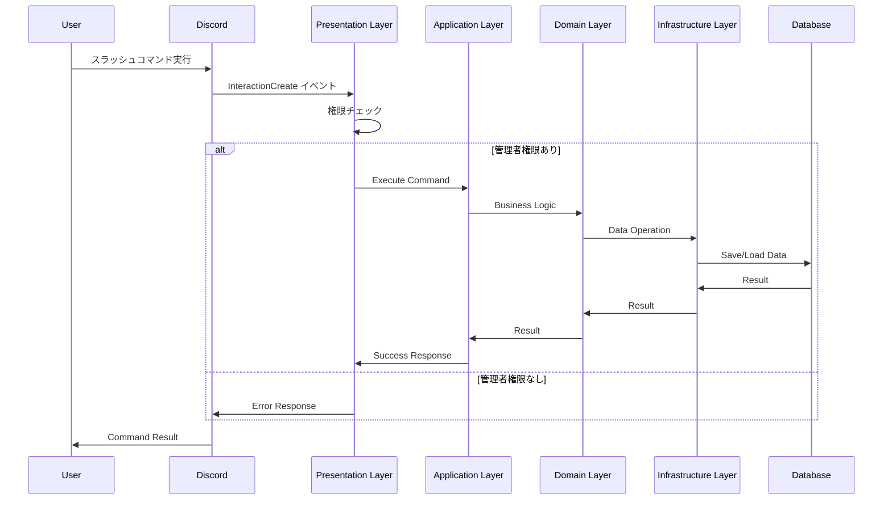

# GeminiBot プロジェクト仕様書

## 概要

GeminiBotは、Discord上で動作し、Googleの生成AIモデル「Gemini」と連携するBotです。ユーザーからのメンションをトリガーとして、指定された範囲のチャット履歴を文脈（コンテキスト）としてGeminiに渡し、その応答をDiscordに投稿する機能を提供します。

## アーキテクチャ

### 設計思想

本プロジェクトは**ドメイン駆動設計 (DDD)** と**クリーンアーキテクチャ**のアプローチを採用しています：

- **ドメイン層**: ビジネスロジック（会話履歴、プロンプト生成、コンテキスト管理など）
- **アプリケーション層**: ユースケース実装（メンション処理、APIキー管理など）
- **インフラストラクチャ層**: Discord API、Gemini APIとの通信、設定管理
- **プレゼンテーション層**: Discordイベントハンドリング、スラッシュコマンド処理

### ディレクトリ構造

```
geminibot/
├── cmd/                    # アプリケーションエントリーポイント
│   └── main.go
├── internal/               # 内部パッケージ
│   ├── domain/            # ドメイン層
│   │   ├── api_key.go
│   │   ├── context_manager.go
│   │   ├── context_manager_test.go
│   │   ├── errors.go
│   │   ├── repository.go
│   │   ├── service.go
│   │   ├── service_test.go
│   │   └── value_objects.go
│   ├── application/       # アプリケーション層
│   │   ├── api_key_service.go
│   │   ├── context_management_test.go
│   │   ├── gemini_client.go
│   │   ├── gemini_client_test.go
│   │   ├── mention_service.go
│   │   └── structured_context_test.go
│   ├── infrastructure/    # インフラストラクチャ層
│   │   ├── config/
│   │   │   └── config.go
│   │   ├── discord/
│   │   │   ├── api_key_repository.go
│   │   │   ├── repository.go
│   │   │   └── repository_test.go
│   │   └── gemini/
│   │       ├── client.go
│   │       ├── client_test.go
│   │       ├── structured_client.go
│   │       └── structured_client_test.go
│   └── presentation/      # プレゼンテーション層
│       └── discord/
│           └── slash_command_handler.go
├── pkg/                   # 公開パッケージ
├── configs/               # 設定ファイル
│   └── config.go
├── docs/                  # ドキュメント
├── logs/                  # ログファイル
├── scripts/               # スクリプト
├── .devcontainer/         # Devcontainer設定
├── Dockerfile             # 本番用Dockerfile
├── compose.yml            # Docker Compose設定
├── Makefile               # ビルドスクリプト
├── go.mod                 # Go依存関係
├── go.sum                 # Go依存関係チェックサム
├── env.example            # 環境変数テンプレート
└── README.md              # プロジェクト概要
```

## 機能仕様

### 1. メンション機能

#### 1.1 基本機能
- Discordチャンネルまたはスレッドでのメンションによる起動
- チャット履歴の自動取得
  - 通常チャンネル：直近10件のメッセージ
  - スレッド：全メッセージ
- Gemini APIとの連携によるAI応答生成
- エラーハンドリングとログ記録

#### 1.2 コンテキスト管理
- **構造化コンテキスト機能**: genaiライブラリの機能を活用した高度なコンテキスト管理
- **コンテキスト長制限機能**: 長すぎるコンテキストによる支離滅裂な応答を防止
- **ContextManager**: ドメインサービスによるコンテキスト管理
- 新しいメッセージから優先的に保持
- 制限を超えた古いメッセージを自動削除
- 完全な文で終わるように調整
- 統計情報の提供（文字数、切り詰め状況など）

### 2. スラッシュコマンド機能

#### 2.1 利用可能なコマンド

| コマンド | 説明 | 権限 |
|---------|------|------|
| `/set-api` | サーバー用のGemini APIキーを設定 | 管理者 |
| `/del-api` | サーバー用のGemini APIキーを削除 | 管理者 |
| `/set-model` | 使用するAIモデルを設定 | 管理者 |
| `/status` | APIキー設定状況を表示 | 全ユーザー |

#### 2.2 モデル選択肢
- Gemini 2.5 Pro (`gemini-2.5-pro`)
- Gemini 2.0 Flash (`gemini-2.0-flash`)
- Gemini 2.5 Flash Lite (`gemini-2.5-flash-lite`)

### 3. APIキー管理機能

#### 3.1 マルチテナント対応
- サーバーごとに個別のAPIキー設定が可能
- デフォルトAPIキーのフォールバック機能
- 設定者情報の記録と表示
- サーバーごとのAIモデル設定

#### 3.2 セキュリティ
- 管理者権限によるAPIキー設定制限
- APIキー情報の暗号化保存（実装予定）
- 設定履歴の記録
- 入力検証とバリデーション

#### 3.3 リポジトリパターン
- `GuildAPIKeyRepository`インターフェースによる抽象化
- `DiscordGuildAPIKeyRepository`による実装
- データの永続化と取得

## 技術仕様

### 1. 技術スタック

- **言語**: Go (Golang) 1.23
- **開発環境**: Devcontainer (Visual Studio Code)
- **実行環境**: Docker
- **主要ライブラリ**:
  - `discordgo`: Discord APIクライアント
  - `google.golang.org/genai`: Google Generative AI SDK
  - `github.com/joho/godotenv`: 環境変数管理
- **アーキテクチャパターン**:
  - ドメイン駆動設計 (DDD)
  - クリーンアーキテクチャ
  - リポジトリパターン
  - ファクトリーパターン

### 2. 環境変数

| 環境変数 | 説明 | デフォルト値 | 必須 |
|---------|------|-------------|------|
| `DISCORD_BOT_TOKEN` | Discord Bot Token | - | ✓ |
| `GEMINI_API_KEY` | Gemini API Key | - | ✓ |
| `GEMINI_MODEL_NAME` | Geminiモデル名 | `gemini-2.5-pro` | - |
| `GEMINI_MAX_TOKENS` | 最大トークン数 | `1000` | - |
| `GEMINI_TEMPERATURE` | 生成の温度パラメータ | `0.7` | - |
| `GEMINI_TOP_P` | Top-Pサンプリング | `0.9` | - |
| `GEMINI_TOP_K` | Top-Kサンプリング | `40` | - |
| `MAX_CONTEXT_LENGTH` | 最大コンテキスト長 | `8000` | - |
| `MAX_HISTORY_LENGTH` | 最大履歴長 | `4000` | - |
| `REQUEST_TIMEOUT` | APIリクエストタイムアウト | `30s` | - |
| `SYSTEM_PROMPT` | システムプロンプト | デフォルトのアシスタントプロンプト | - |

### 3. 設定パラメータ

#### 3.1 Gemini API設定
- **モデル**: Gemini 2.5 Pro（デフォルト）
- **最大トークン数**: 1000
- **温度パラメータ**: 0.7
- **Top-P**: 0.9
- **Top-K**: 40

#### 3.2 コンテキスト管理設定
- **最大コンテキスト長**: 8000文字
- **最大履歴長**: 4000文字
- **リクエストタイムアウト**: 30秒

## データフロー

### 1. メンション処理フロー



### 2. スラッシュコマンド処理フロー



## エラーハンドリング

### 1. エラー分類

| エラー種別 | 説明 | 対応 |
|-----------|------|------|
| API接続エラー | Gemini APIへの接続失敗 | リトライ + エラーメッセージ |
| 権限エラー | 管理者権限不足 | エラーメッセージ表示 |
| 設定エラー | 無効な設定値 | バリデーション + エラーメッセージ |
| コンテキストエラー | コンテキスト構築失敗 | フォールバック処理 |

### 2. ログ出力

- **レベル**: INFO, WARN, ERROR
- **出力先**: 標準出力 + ファイル（`logs/`ディレクトリ）
- **ログ内容**: タイムスタンプ、レベル、メッセージ、エラー詳細

## セキュリティ

### 1. 認証・認可

- Discord Bot Tokenによる認証
- 管理者権限によるAPIキー設定制限
- サーバーごとのAPIキー分離

### 2. データ保護

- APIキーの暗号化保存（実装予定）
- ログからの機密情報除外
- 環境変数による設定管理

## パフォーマンス

### 1. 最適化

- コンテキスト長制限による効率的なトークン使用
- 非同期処理による応答性向上
- キャッシュ機能（実装予定）

### 2. 制限事項

- 同時処理数制限
- APIレート制限対応
- メモリ使用量制限

## 拡張性

### 1. 将来の拡張予定

- 複数AIモデル対応
- カスタムプロンプト機能
- 会話履歴の永続化
- 統計・分析機能
- Webhook対応

### 2. プラグイン機能

- カスタムコマンド追加
- 外部API連携
- データベース連携

## 運用・保守

### 1. 監視

- ヘルスチェック機能
- メトリクス収集
- アラート機能

### 2. デプロイ

- Dockerコンテナ化
- CI/CDパイプライン
- ロールバック機能

### 3. バックアップ

- 設定データのバックアップ
- ログファイルのローテーション
- 災害復旧計画

## ライセンス

MIT License

## コントリビューション

プルリクエストやイシューの報告を歓迎します。コントリビューションガイドラインに従ってご参加ください。
